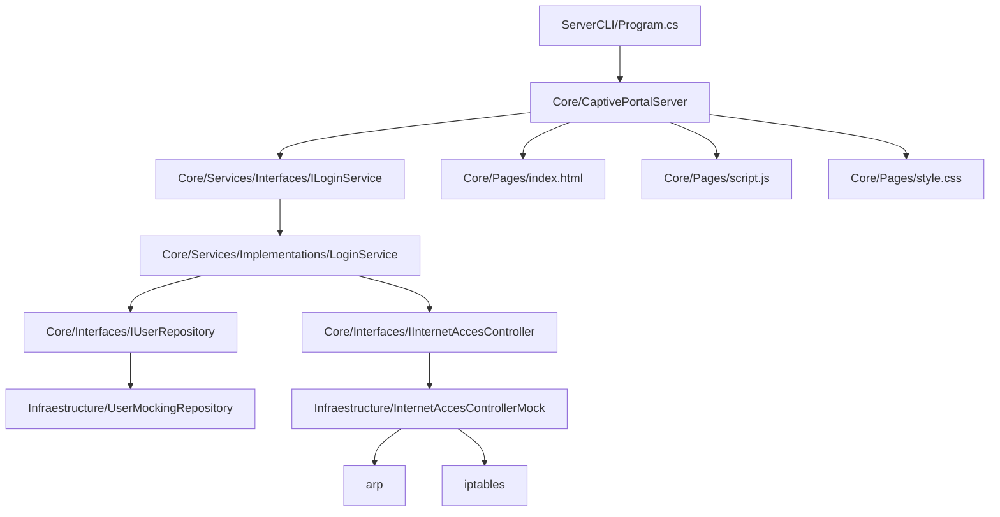
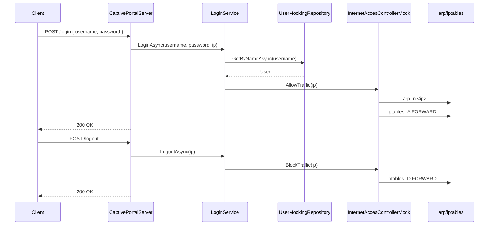

# CaptivePortal

A lightweight Linux captive-portal prototype implemented in C#.
It creates a local Wi-Fi LAN/AP environment (via `hostapd` + `dnsmasq`) and runs a custom HTTP server that serves a login page.  
When a user logs in successfully, the server allows traffic for that client by adding `iptables` forwarding rules based on the client MAC/IP; logout removes those rules.

## What this project currently does

This repository combines two parts:

1. **Network/AP setup scripts and configs** (Linux shell + `dnsmasq`/`hostapd`)
2. **A .NET server** that serves captive portal pages and handles `/login` and `/logout`

The current implementation is a **prototype/development setup** with mock infrastructure (in-memory users, direct process calls to `arp`/`iptables`).

## Features

- Custom asynchronous TCP HTTP server (`AsyncServerBase`)
- Captive portal endpoints:
  - `GET /` → serves login page
  - `GET /script.js` and `GET /style.css` → serves static assets
  - `POST /login` → validates credentials and allows traffic
  - `POST /logout` → blocks traffic
- Login service abstraction (`ILoginService`) with implementation (`LoginService`)
- User repository abstraction (`IUserRepository`) with in-memory mock (`UserMockingRepository`)
- Internet access controller abstraction (`IInternetAccesController`) with `iptables`/`arp` implementation (`InternetAccesControllerMock`)
- Linux helper scripts to start/stop LAN AP services
- Basic test project scaffold (`TestProject`)

## Repository structure

```text
.
├── configurations/
│   ├── dnsmasq.conf        # Example dnsmasq captive-LAN config
│   └── hospapd.conf        # Example hostapd config (filename currently misspelled)
├── scripts/
│   ├── get_mac.sh          # ARP-based MAC lookup helper
│   ├── start_lan.sh        # Starts hostapd + dnsmasq, assigns AP IP, enables NAT
│   └── stop_lan.sh         # Stops services and removes AP IP
├── src/
│   ├── Core/               # Domain/server logic (HTTP parser, responses, portal server, services)
│   ├── Infraestructure/    # Infra implementations (iptables/arp controller, mock user repo)
│   ├── ServerCLI/          # Console entrypoint that wires dependencies and starts server
│   └── TestProject/        # MSTest project
├── CaptivePortal.sln
└── README.md
```

## Requirements

- Linux environment (scripts use `systemctl`, `ip`, `sysctl`, `iptables`, `arp`)
- Installed and configured:
  - `hostapd`
  - `dnsmasq`
- .NET SDK supporting target framework in this repo (`net10.0` currently set in projects)
- Sudo/root privileges for networking and firewall commands

## Network configuration

The committed config/scripts currently assume:

- Wireless interface: `wlp1s0`
- Captive/AP gateway IP: `192.168.4.1/24`
- DHCP range: `192.168.4.2 - 192.168.4.100`
- Captive DNS address mapping: `server.lan -> 192.168.4.1`
- Server binding: `192.168.4.1:8000`

### Configuration files

- `configurations/dnsmasq.conf` is intended for `/etc/dnsmasq.conf`
- `configurations/hospapd.conf` is intended for `/etc/hostapd/hostapd.conf`
  - Note: file is named `hospapd.conf` in repo, but contents/comments indicate hostapd config.

## Setup

### 1) Clone the repository

```bash
git clone https://github.com/crackbandicoot-dot/CaptivePortal.git
cd CaptivePortal
```

### 2) Install/configure system dependencies

Install `hostapd`, `dnsmasq`, and ensure tools like `ip`, `iptables`, `arp`, `systemctl` are available.

### 3) Copy configuration files

Back up your current system configs first, then apply:

```bash
sudo cp configurations/dnsmasq.conf /etc/dnsmasq.conf
sudo cp configurations/hospapd.conf /etc/hostapd/hostapd.conf
```

### 4) Start AP/LAN services

```bash
sudo bash scripts/start_lan.sh
```

This script currently:
- starts `hostapd`
- starts `dnsmasq`
- adds `192.168.4.1/24` to `wlp1s0`
- enables IPv4 forwarding
- adds NAT masquerade rule

## Running the server

From the repository root:

```bash
dotnet run --project src/ServerCLI/ServerCLI.csproj -- --start
```

The server is started by `src/ServerCLI/Program.cs` and currently binds to:

- `192.168.4.1`
- port `8000`

### Login credentials (current mock)

`UserMockingRepository` is preloaded with a single user:

- username: `username`
- password: `password`

## Stopping services

To stop AP/LAN:

```bash
sudo bash scripts/stop_lan.sh
```

This stops `hostapd` + `dnsmasq` and removes `192.168.4.1/24` from `wlp1s0`.

## Architecture

### Layer / component view



### Runtime request flow

```mermaid
flowchart LR
    Client[Wi-Fi Client] -->|HTTP GET /| Server[CaptivePortalServer]
    Server -->|Serve static page| Client
    Client -->|POST /login {username,password}| Server
    Server --> LoginSvc[LoginService]
    LoginSvc --> UserRepo[UserMockingRepository]
    UserRepo --> LoginSvc
    LoginSvc --> AccessCtl[InternetAccesControllerMock]
    AccessCtl -->|Resolve MAC| ARP[arp -n]
    AccessCtl -->|Allow traffic rules| IPT[iptables -A FORWARD ...]
    Server -->|200 OK| Client
```

### Login / logout sequence



## Important current limitations / notes

- `Program.cs` contains a hardcoded pages path:
  `"/media/chris/Windows/OSShared/CaptivePortal/src/Core/Pages"`
  - You will likely need to change this path for your machine.
- Interface/config values are hardcoded (e.g., `wlp1s0`, `192.168.4.1`).
- Error handling and HTTP parsing are minimal (prototype-level).
- User storage is in-memory mock only.
- Folder/project naming contains typos (e.g., `Infraestructure`, `hospapd`, `Acces`).

## Scripts summary

- `scripts/start_lan.sh`  
  Bring up AP-side networking and NAT forwarding.

- `scripts/stop_lan.sh`  
  Tear down AP-side services and IP assignment.

- `scripts/get_mac.sh`  
  Reads ARP table to print a MAC for a target IP.

## Development

Build:

```bash
dotnet build src/src.sln
```

Run tests:

```bash
dotnet test src/TestProject/TestProject.csproj
```
