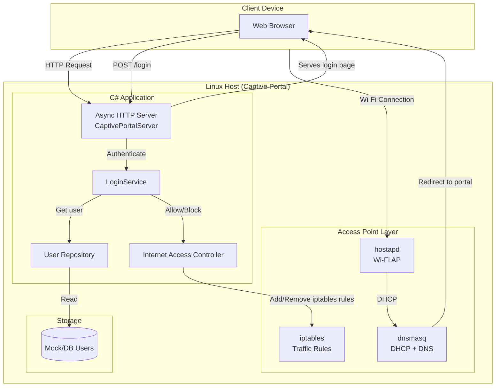
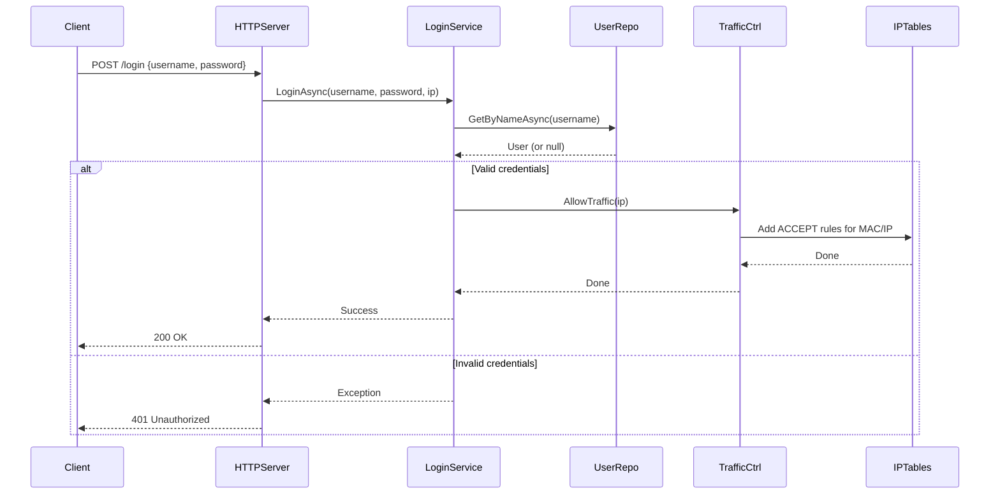

# Captive Portal for Linux (C#)
[Screenshot](captive_portal_screenshot.png)
A lightweight, self-contained captive portal solution built in C# for Linux environments. This project turns a Linux machine into a Wi-Fi access point with a captive portal login page, allowing you to control internet access for connected clients.

---

## 📋 Table of Contents

- [Overview](#overview)
- [Features](#features)
- [Architecture](#architecture)
- [Prerequisites](#prerequisites)
- [Setup & Installation](#setup--installation)
- [Usage](#usage)
- [Configuration](#configuration)
- [Project Structure](#project-structure)
- [Notes](#notes)

---

## Overview

This captive portal system consists of:

1. **C# HTTP Server** – Serves the login page and handles authentication logic.
2. **Access Point (AP)** – Uses `hostapd` and `dnsmasq` to create a Wi-Fi network.
3. **Traffic Control** – Uses `iptables` to allow/block internet access per client.
4. **Web Interface** – A clean login/logout page served to connecting clients.

When a client connects to the Wi-Fi network and tries to browse the web, they're redirected to the captive portal login page. After successful authentication, their IP/MAC is allowed through the firewall until they log out.

---

## Features

- ✅ **Captive Portal** – Web-based authentication page
- ✅ **Access Point Management** – Creates a Wi-Fi hotspot using `hostapd`
- ✅ **DHCP & DNS** – Managed by `dnsmasq`
- ✅ **Per-Client Traffic Control** – Allows/Blocks internet access using `iptables`
- ✅ **Login/Logout** – Session management via IP address
- ✅ **Async HTTP Server** – Built from scratch using sockets
- ✅ **Extensible** – Easy to replace user repository or traffic controller
- ✅ **Lightweight** – No external web server or framework required

---

## Architecture



---

## Request Flow (Login)



---

## Prerequisites

- **Linux distribution** (tested on Debian/Ubuntu-based systems)
- **.NET SDK 7.0+** (for building the C# application)
- **Wireless adapter** that supports AP mode (e.g., `wlp1s0`)
- **Root/sudo privileges** (for managing network interfaces and iptables)

### Required Linux Packages

```bash
sudo apt update
sudo apt install -y hostapd dnsmasq iptables wireless-tools
```

---

## Setup & Installation

### 1. Clone or Download the Project

```bash
git clone <repository-url>
cd CaptivePortal-main
```

### 2. Build the C# Application

```bash
dotnet build src/CaptivePortal.csproj
```

Or publish as a standalone executable:

```bash
dotnet publish src/CaptivePortal.csproj -c Release -o ./publish
```

### 3. Configure the Access Point

The project includes configuration files for `hostapd` and `dnsmasq`.

#### Copy configurations (adjust paths as needed):

```bash
sudo cp configs/dnsmasq.conf /etc/dnsmasq.conf
sudo cp configs/hostapd.conf /etc/hostapd/hostapd.conf
```

> **Note:** The scripts and configs assume the wireless interface is `wlp1s0`. If your interface is different, update all files accordingly.

### 4. Prepare the Web Pages

The HTML, CSS, and JS files are served from the `pages/` directory. Place them where the application can read them:

```bash
mkdir -p /var/www/captive
cp pages/* /var/www/captive/
```

Update the `pagesDirectory` path in the server initialization accordingly.

---

## Usage

### Starting the Captive Portal

A helper script is provided to start the AP, configure routing, and launch the C# server.

```bash
# Start AP and routing
sudo ./scripts/start_ap.sh

# Run the C# server (as root for iptables access)
sudo dotnet run --project src/CaptivePortal.csproj
```

Or if published:

```bash
sudo ./publish/CaptivePortal
```

### Stopping the Captive Portal

```bash
sudo ./scripts/stop_ap.sh
```

---

## Configuration

### `dnsmasq.conf` (DHCP & DNS)

```ini
interface=wlp1s0
dhcp-range=192.168.4.2,192.168.4.100,255.255.255.0,24h
server=8.8.8.8
server=8.8.4.4
address=/server.lan/192.168.4.1
```

- **DHCP range**: 192.168.4.2–100
- **DNS**: Google Public DNS
- **Redirect**: `server.lan` resolves to 192.168.4.1 (the AP IP)

### `hostapd.conf` (Access Point)

```ini
interface=wlp1s0
driver=nl80211
ssid=MyAccessPoint
hw_mode=g
channel=7
wpa=3
wpa_passphrase=MyPassword
```

- **SSID**: `MyAccessPoint`
- **Passphrase**: `MyPassword`
- **Channel**: 7 (2.4 GHz)

### C# Application

- **EndPoint**: The server listens on `192.168.4.1:8000` (default).
- **Pages Directory**: Path to the HTML/CSS/JS files.
- **User Repository**: The `UserMockingRepository` contains a default user:
  - Username: `username`
  - Password: `password`
- **Internet Access Controller**: The `InternetAccesControllerMock` uses `arp` and `iptables` to manage traffic.

---

## Project Structure

```
CaptivePortal-main/
├── src/
│   ├── Core/
│   │   ├── AsyncHttpServerBase.cs       # Async socket server base
│   │   ├── CaptivePortalServer.cs       # HTTP request handler
│   │   ├── Models/
│   │   │   ├── HttpRequest.cs
│   │   │   ├── HttpResponse.cs
│   │   │   ├── Request.cs
│   │   │   └── User.cs
│   │   ├── Services/
│   │   │   ├── Interfaces/
│   │   │   │   └── ILoginService.cs
│   │   │   └── Implementations/
│   │   │       └── LoginService.cs
│   │   └── Interfaces/
│   │       ├── IUserRepository.cs
│   │       └── IInternetAccesController.cs
│   ├── Infraestructure/
│   │   ├── UserMockingRepository.cs
│   │   └── InternetAccesControllerMock.cs
│   └── Program.cs                        # Entry point
├── pages/
│   ├── index.html
│   ├── style.css
│   └── script.js
├── scripts/
│   ├── start_ap.sh                       # Starts hostapd + dnsmasq + routing
│   └── stop_ap.sh                        # Tears down AP and routing
├── configs/
│   ├── dnsmasq.conf
│   └── hostapd.conf
└── README.md
```

---

## Notes

- **Root privileges** are required because the application modifies `iptables` rules and network interfaces.
- The `InternetAccesControllerMock` uses `arp -n <ip>` to resolve MAC addresses. This depends on the ARP cache being populated (the client must have sent some traffic).
- The captive portal detection may require additional DNS redirection. The current setup uses `address=/server.lan/192.168.4.1` in `dnsmasq` to resolve a domain to the portal IP.
- This is a **functional prototype**. For production, consider:
  - Using a proper database instead of the in-memory mock repository.
  - Implementing session management with cookies/tokens.
  - Adding HTTPS support.
  - Handling edge cases (e.g., ARP cache misses, client reconnects).

---

## Troubleshooting

### Clients can't see the login page

- Ensure `hostapd` and `dnsmasq` are running: `sudo systemctl status hostapd dnsmasq`
- Check that the C# server is listening: `sudo netstat -tulpn | grep 8000`
- Verify client IP is in the 192.168.4.0/24 range.

### Login fails

- Check server logs for exceptions.
- Verify the user exists in `UserMockingRepository`.
- Ensure `iptables` rules are being applied: `sudo iptables -L FORWARD -v`

### ARP cache issues

- Run `arp -n` on the server to see if the client's MAC is resolved.
- You can manually ping the client: `ping 192.168.4.x` to populate ARP.

---

## License

This project is provided as-is. Feel free to modify and distribute as needed.

---

**Happy Hacking!** 🚀
